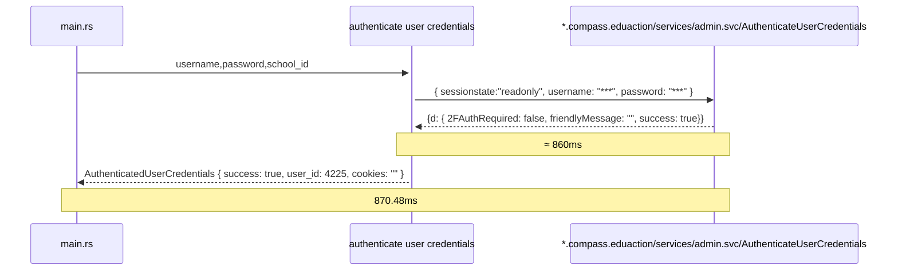

```mermaid
sequenceDiagram
    participant A as main.rs
    participant B as authenticate user credentials
    participant C as *.compass.eduaction/services/admin.svc/AuthenticateUserCredentials
    A ->>+ B: username,password,school_id
    B ->> C: { sessionstate:"readonly", username: "***", password: "***" }
    C -->> B: {d: { 2FAuthRequired: false, friendlyMessage: "", success: true}}
    Note over B,C: ≈ 860ms
    B -->> A : AuthenticatedUserCredentials { success: true, user_id: 4225, cookies: "" }
    Note over C,A: 870.48ms
```